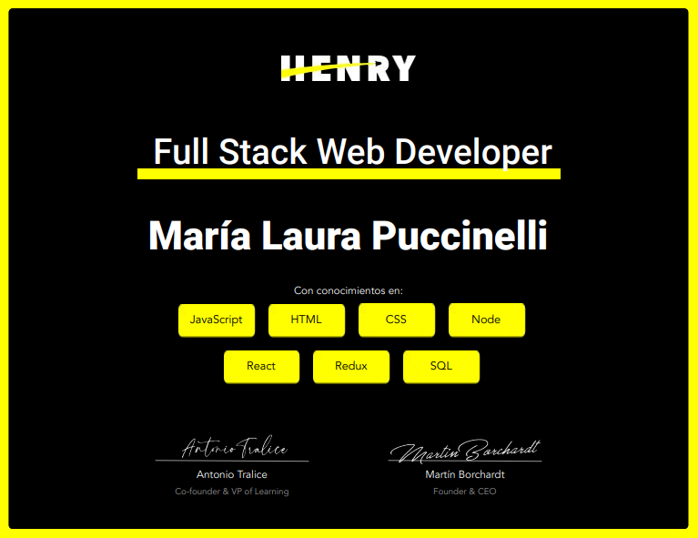

### Hi! I'm Laura Puccinelli

### I'm a Full Stack Developer
### About me 😄 :
I'm convinced that the programming path is a continuous learning. I like to work with new technologies, improve and face different challenges. In February 2021 I finished the SoyHenry bootcamp, in which learned many technologies and also carried out two projects, a web e-commerce and an educational application. I like to work in teams and I believe that this is fundamental to develop interesting and challenging projects.

- 🔭 I’m currently open to work

### STACK

| **FullStack** | ✔ | ✔ | ✔ | ✔ | ✔ | ✔ | ✔ | ✔ |
| --------- | ------ | ------- | ------- | ------- | ------- | ------- | ------- | ------- | ------- |
|  | HTML | CSS | React Native | React | Redux | React-Routing | Styled-Components | Expo |
|  | NodeJs | Express | PostgreSQL | MongoDB | Sequelize | GraphQL | Apollo | JavaScript |

### Soy Henry
I studied at the Soy Henry bootcamp from October 2020 to February 2021

